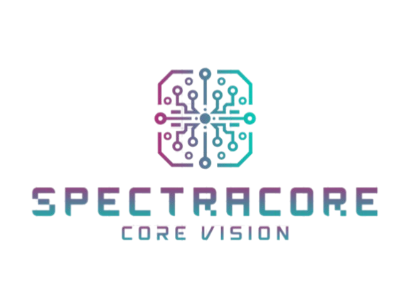

  

# SpectraCore

SpectraCore is a collaborative software development project created by a multidisciplinary team, using modern technologies, structured workflows, and the Scrum methodology to ensure efficiency, clarity, and continuous improvement.

---

## 👥 Team Members

| Role | Name |
|------|------|
| **Scrum Trainer** | Antonio Ivanov |
| **Backend Developer** | Ivan Lapchev |
| **Frontend Developer** | Georgi Georgiev |
| **Designer** | Stoyan Savakov |

---

## 🧰 Technologies & Tools

### 🖥️ Programming Languages
- **C++**

---

### 🔧 Development Environment

- **Visual Studio** – used for writing and maintaining the source code.

---

### 📝 Documentation

- **Microsoft Word** – used for documentation, planning, and reports.

---

### 🎨 Design Tools

- **Canva** – used for presentation design and visual assets.

---
